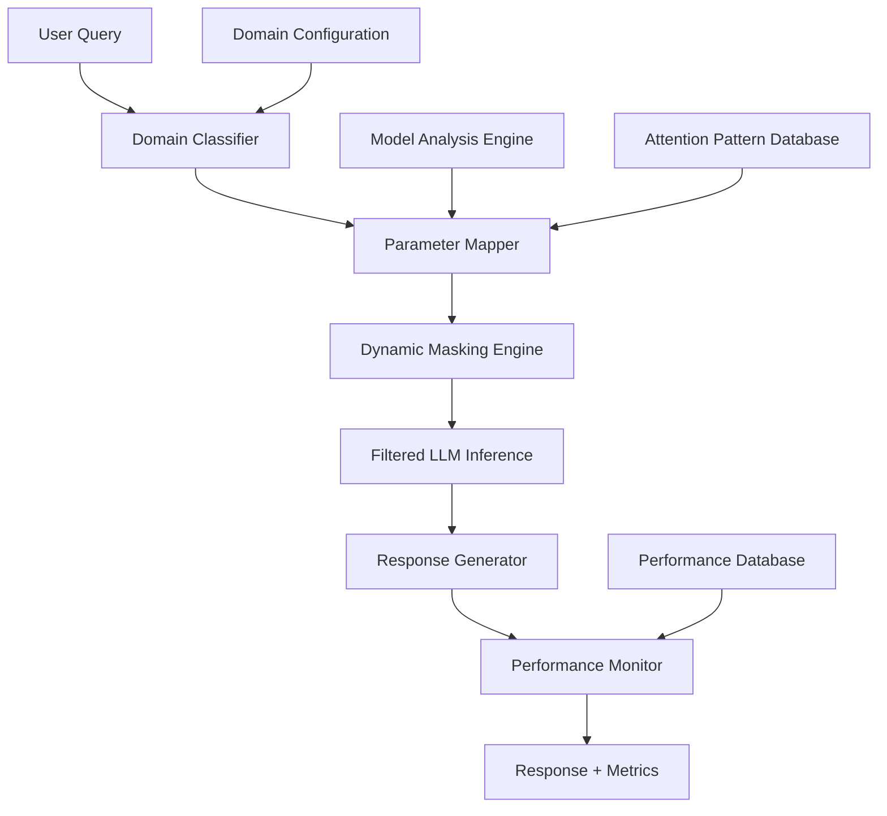

# Design Document: Dynamic Knowledge Filtering System

## Overview

The Dynamic Knowledge Filtering System implements a novel approach to LLM optimization through context-aware parameter activation. The system creates a meta-learning layer that analyzes incoming queries, identifies relevant knowledge domains, and dynamically masks irrelevant model parameters during inference. This approach reduces computational load while maintaining task-specific accuracy.

The core innovation combines attention pattern analysis, domain-specific parameter mapping, and real-time inference optimization to create specialized "views" of a base model without requiring separate fine-tuned models for each domain.

## Architecture

### High-Level System Architecture



### Core Components

#### 1. Domain Classifier
- **Purpose**: Analyzes incoming queries to identify relevant knowledge domains
- **Technology**: Lightweight sentence transformer (all-MiniLM-L6-v2, 22MB) with keyword matching fallback
- **Input**: Raw user query text
- **Output**: Domain probabilities and confidence scores
- **Performance Target**: <50ms classification time on CPU
- **Hardware Optimization**: CPU-only inference, quantized models for memory efficiency

#### 2. Parameter Mapper
- **Purpose**: Maps model parameters to knowledge domains using lightweight analysis
- **Technology**: Statistical analysis of parameter activations with CPU-optimized clustering
- **Process**: 
  - Uses small sample datasets to analyze parameter importance per domain
  - Applies k-means clustering on CPU to group parameters by domain relevance
  - Creates sparse activation masks optimized for 12GB RAM constraint
- **Storage**: Local file cache (JSON/pickle) to avoid Redis memory overhead
- **Hardware Optimization**: Batch processing to minimize memory peaks, progressive loading

#### 3. Dynamic Masking Engine
- **Purpose**: Applies parameter masks during inference to focus on relevant knowledge
- **Implementation**: Custom PyTorch hooks that modify forward pass computations
- **Strategies**:
  - **Hard Masking**: Complete deactivation of irrelevant parameters (0 values)
  - **Soft Masking**: Weighted reduction of irrelevant parameters (0.1-0.3 scaling)
  - **Adaptive Masking**: Dynamic adjustment based on confidence scores

#### 4. Performance Monitor
- **Purpose**: Tracks filtering effectiveness and system performance
- **Metrics**: Inference time, memory usage, accuracy scores, parameter reduction
- **Technology**: Prometheus + Grafana for real-time monitoring
- **Alerting**: Automatic fallback triggers when performance degrades

## Components and Interfaces

### Domain Classifier Interface

```python
class DomainClassifier:
    def classify_query(self, query: str) -> DomainPrediction:
        """
        Classifies query into relevant knowledge domains
        
        Args:
            query: Input text query
            
        Returns:
            DomainPrediction with probabilities and confidence
        """
        pass
    
    def update_domains(self, domain_config: DomainConfig) -> bool:
        """Updates domain definitions and retrains classifier"""
        pass
```

### Parameter Mapper Interface

```python
class ParameterMapper:
    def analyze_model(self, model: torch.nn.Module) -> ParameterMapping:
        """
        Analyzes model to create parameter-domain mappings
        
        Args:
            model: PyTorch model to analyze
            
        Returns:
            ParameterMapping with domain-specific masks
        """
        pass
    
    def get_domain_mask(self, domains: List[str], confidence: float) -> torch.Tensor:
        """Retrieves parameter mask for specified domains"""
        pass
```

### Dynamic Masking Engine Interface

```python
class DynamicMaskingEngine:
    def apply_filtering(self, model: torch.nn.Module, mask: torch.Tensor) -> None:
        """Applies parameter masking to model during inference"""
        pass
    
    def remove_filtering(self, model: torch.nn.Module) -> None:
        """Removes all parameter masks and restores full model"""
        pass
```

## Data Models

### Domain Configuration

```python
@dataclass
class DomainConfig:
    name: str
    keywords: List[str]
    parent_domain: Optional[str]
    weight: float
    description: str
    examples: List[str]
```

### Domain Prediction

```python
@dataclass
class DomainPrediction:
    domains: Dict[str, float]  # domain -> probability
    confidence: float
    processing_time: float
    fallback_required: bool
```

### Parameter Mapping

```python
@dataclass
class ParameterMapping:
    domain_masks: Dict[str, torch.Tensor]
    layer_importance: Dict[str, float]
    attention_patterns: Dict[str, np.ndarray]
    coverage_metrics: Dict[str, float]
```

### Performance Metrics

```python
@dataclass
class PerformanceMetrics:
    inference_time: float
    memory_usage: float
    parameter_reduction: float
    accuracy_score: float
    confidence_score: float
    domain_distribution: Dict[str, float]
```

## Error Handling

### Classification Errors
- **Low Confidence**: Automatic fallback to full model when confidence < 0.8
- **Domain Mismatch**: Graceful handling of queries spanning multiple domains
- **Timeout Handling**: 100ms timeout for domain classification with fallback

### Masking Errors
- **Invalid Masks**: Validation of mask dimensions and data types
- **Memory Overflow**: Dynamic adjustment of masking intensity based on available memory
- **Model Compatibility**: Automatic detection of unsupported model architectures

### Performance Degradation
- **Accuracy Monitoring**: Continuous comparison with baseline performance
- **Automatic Fallback**: Disable filtering when accuracy drops below 95% of baseline
- **Alert System**: Real-time notifications for system administrators

## Testing Strategy

### Unit Testing
- **Domain Classifier**: Test classification accuracy across different query types
- **Parameter Mapper**: Validate mask generation and parameter coverage
- **Masking Engine**: Verify correct application and removal of masks
- **Performance Monitor**: Test metric collection and alerting systems

### Integration Testing
- **End-to-End Workflows**: Complete query processing with filtering enabled
- **Model Compatibility**: Testing across different LLM architectures (GPT, BERT, T5)
- **Concurrent Processing**: Multi-threaded inference with dynamic filtering
- **Fallback Mechanisms**: Automatic recovery from various failure scenarios

### Performance Testing
- **Latency Benchmarks**: Measure inference time improvements across domains
- **Memory Usage**: Track memory reduction with different masking strategies
- **Accuracy Validation**: Compare filtered vs unfiltered responses across test datasets
- **Scalability Testing**: Performance under high concurrent load

### Domain-Specific Testing
- **Medical Queries**: Test filtering effectiveness for medical knowledge
- **Technical Documentation**: Evaluate performance on programming and technical queries
- **General Knowledge**: Ensure broad queries still receive comprehensive responses
- **Cross-Domain Queries**: Test handling of queries spanning multiple domains

## Implementation Details

### Model Analysis Pipeline

1. **Attention Pattern Extraction**
   - Run representative queries from each domain through the base model
   - Extract attention weights from all transformer layers
   - Identify neurons with high activation for domain-specific content

2. **Parameter Clustering**
   - Use gradient-based attribution to identify important parameters
   - Apply clustering algorithms to group parameters by domain relevance
   - Create sparse binary masks for each domain cluster

3. **Validation and Optimization**
   - Test mask effectiveness on held-out domain-specific datasets
   - Optimize mask sparsity to balance performance and accuracy
   - Generate confidence thresholds for automatic fallback

### Real-Time Inference Flow

1. **Query Processing**
   - Tokenize and embed incoming query
   - Run through domain classifier (target: <50ms)
   - Generate domain probability distribution

2. **Mask Selection**
   - Retrieve pre-computed masks for top domains
   - Combine masks using weighted averaging based on probabilities
   - Apply confidence-based adjustments

3. **Filtered Inference**
   - Install PyTorch hooks to apply parameter masks
   - Run standard model inference with masked parameters
   - Monitor performance metrics during generation

4. **Response Post-Processing**
   - Remove parameter masks to restore full model
   - Log performance metrics and domain usage
   - Return response with confidence scores

### Deployment Architecture

- **API Gateway**: FastAPI with async request handling
- **Model Serving**: TorchServe with custom inference handlers
- **Caching Layer**: Redis for mask storage and query caching
- **Monitoring**: Prometheus metrics with Grafana dashboards
- **Configuration**: Dynamic domain updates through admin API