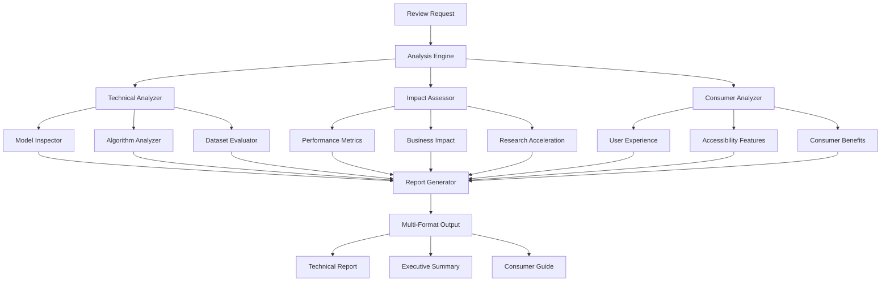

# Design Document: Post-Project Review System

## Overview

The Post-Project Review System is a comprehensive analysis and documentation generator for the Protein-Drug Discovery Platform. It creates structured technical reviews, impact assessments, and consumer-facing documentation by analyzing the existing platform architecture, performance metrics, and capabilities. The system serves multiple stakeholders with tailored content depth and format.

## Architecture

### System Components



## Components and Interfaces

### 1. Analysis Engine

**Purpose**: Orchestrates the review process and coordinates different analyzers

**Key Methods**:
- `generate_review(review_type: str, audience: str) -> ReviewReport`
- `analyze_platform_components() -> ComponentAnalysis`
- `assess_performance_metrics() -> PerformanceReport`

**Interfaces**:
```python
class AnalysisEngine:
    def __init__(self, platform_path: str):
        self.technical_analyzer = TechnicalAnalyzer(platform_path)
        self.impact_assessor = ImpactAssessor()
        self.consumer_analyzer = ConsumerAnalyzer()
    
    def generate_comprehensive_review(self) -> ComprehensiveReport:
        """Generate complete post-project review"""
        pass
```

### 2. Technical Analyzer

**Purpose**: Analyzes ML/DL models, algorithms, and technical implementation

**Key Components**:

#### 2.1 Model Inspector
- **ESM-2 Analysis**: Architecture details, parameter count, optimization strategies
- **LoRA Framework**: Adaptation matrices, efficiency metrics, training approach
- **Algorithm Documentation**: Attention mechanisms, embeddings, activation functions

#### 2.2 Algorithm Analyzer
- **Protein Processing**: Sequence encoding, validation, statistical analysis
- **Drug Analysis**: SMILES processing, molecular descriptors, Lipinski rules
- **Interaction Prediction**: Similarity calculations, binding probability, confidence scoring

#### 2.3 Dataset Evaluator
- **Data Sources**: UniProt, ChEMBL, BindingDB characteristics
- **Coverage Analysis**: Size metrics, quality indicators, bias assessment
- **Training Data**: Validation approaches, test set composition

**Implementation**:
```python
class TechnicalAnalyzer:
    def analyze_ml_models(self) -> ModelAnalysis:
        """Analyze ESM-2, LoRA, and associated algorithms"""
        return {
            'esm2_model': self._analyze_esm2(),
            'lora_framework': self._analyze_lora(),
            'algorithms': self._analyze_algorithms()
        }
    
    def analyze_datasets(self) -> DatasetAnalysis:
        """Analyze training and validation datasets"""
        return {
            'uniprot': self._analyze_uniprot(),
            'chembl': self._analyze_chembl(),
            'bindingdb': self._analyze_bindingdb()
        }
```

### 3. Impact Assessor

**Purpose**: Evaluates real-world problem solving and business impact

**Key Metrics**:
- **Time Acceleration**: Drug discovery timeline reduction (10-15 years → days for screening)
- **Cost Reduction**: Computational and experimental cost savings (95% reduction)
- **Accessibility**: Hardware democratization (GPU clusters → CPU-only)
- **Research Enablement**: Smaller labs and institutions participation

**Implementation**:
```python
class ImpactAssessor:
    def assess_real_world_impact(self) -> ImpactReport:
        """Assess platform's real-world problem solving capabilities"""
        return {
            'drug_discovery_acceleration': self._analyze_time_savings(),
            'cost_reduction': self._analyze_cost_benefits(),
            'research_democratization': self._analyze_accessibility(),
            'drug_repurposing': self._analyze_repurposing_benefits()
        }
```

### 4. Consumer Analyzer

**Purpose**: Evaluates consumer-facing capabilities and user benefits

**Key Areas**:
- **Drug Information Access**: Medication search, mechanism explanations, interaction data
- **Personalized Medicine**: Protein variant analysis, drug interaction assessment
- **Educational Features**: Interactive visualizations, simplified explanations
- **Accessibility**: Hardware requirements, interface usability, guided workflows

**Implementation**:
```python
class ConsumerAnalyzer:
    def analyze_consumer_capabilities(self) -> ConsumerReport:
        """Analyze features accessible to non-expert users"""
        return {
            'drug_information': self._analyze_drug_info_features(),
            'personalized_medicine': self._analyze_personalization(),
            'educational_features': self._analyze_education_tools(),
            'accessibility': self._analyze_user_accessibility()
        }
```

### 5. Report Generator

**Purpose**: Creates structured output in multiple formats for different audiences

**Output Formats**:
- **Technical Report**: Detailed technical analysis for developers and researchers
- **Executive Summary**: High-level business impact and strategic insights
- **Consumer Guide**: User-friendly explanations and practical applications

## Data Models

### ReviewReport
```python
@dataclass
class ReviewReport:
    title: str
    audience: str
    generated_at: datetime
    technical_analysis: TechnicalAnalysis
    impact_assessment: ImpactAssessment
    consumer_analysis: ConsumerAnalysis
    limitations: List[str]
    future_scope: List[str]
    recommendations: List[str]
```

### TechnicalAnalysis
```python
@dataclass
class TechnicalAnalysis:
    ml_models: Dict[str, ModelDetails]
    algorithms: Dict[str, AlgorithmDetails]
    datasets: Dict[str, DatasetDetails]
    performance_metrics: PerformanceMetrics
    architecture_overview: str
```

### ModelDetails
```python
@dataclass
class ModelDetails:
    name: str
    architecture: str
    parameters: int
    training_approach: str
    optimization: str
    performance: Dict[str, float]
    use_case: str
```

### ImpactAssessment
```python
@dataclass
class ImpactAssessment:
    problem_solving: Dict[str, str]
    quantitative_benefits: Dict[str, float]
    comparison_traditional: Dict[str, str]
    success_stories: List[str]
    market_impact: str
```

### ConsumerAnalysis
```python
@dataclass
class ConsumerAnalysis:
    accessible_features: List[str]
    user_benefits: Dict[str, str]
    usability_features: List[str]
    practical_applications: List[str]
    hardware_requirements: Dict[str, str]
```

## Error Handling

### Analysis Errors
- **Missing Components**: Graceful degradation when platform components are unavailable
- **Data Access Issues**: Fallback to cached or mock data when external APIs fail
- **Performance Calculation**: Handle missing metrics with estimated values

### Report Generation Errors
- **Format Issues**: Validate output format compatibility
- **Content Validation**: Ensure all required sections are present
- **Export Failures**: Provide alternative output formats

## Testing Strategy

### Unit Tests
- **Analyzer Components**: Test individual analysis functions
- **Data Processing**: Validate metric calculations and data extraction
- **Report Generation**: Test output format generation

### Integration Tests
- **End-to-End Review**: Complete review generation workflow
- **Multi-Format Output**: Validate all output formats
- **Error Scenarios**: Test graceful error handling

### Performance Tests
- **Analysis Speed**: Ensure review generation completes within reasonable time
- **Memory Usage**: Monitor resource consumption during analysis
- **Scalability**: Test with different platform sizes

## Implementation Details

### Platform Analysis Approach
1. **Code Inspection**: Parse existing platform files to extract technical details
2. **Performance Monitoring**: Analyze logged metrics and benchmark results
3. **Documentation Mining**: Extract information from README, PRD, and code comments
4. **Dynamic Analysis**: Run platform components to gather runtime characteristics

### Content Generation Strategy
1. **Template-Based**: Use structured templates for consistent formatting
2. **Audience-Specific**: Adjust technical depth based on target audience
3. **Evidence-Based**: Support claims with concrete metrics and examples
4. **Visual Elements**: Include diagrams, charts, and code snippets where appropriate

### Output Format Support
- **Markdown**: Primary format for technical documentation
- **HTML**: Web-friendly format with enhanced styling
- **PDF**: Professional reports for stakeholders
- **JSON**: Structured data for programmatic access

This design provides a comprehensive framework for generating detailed post-project reviews that serve multiple stakeholders while maintaining technical accuracy and appropriate content depth for each audience.