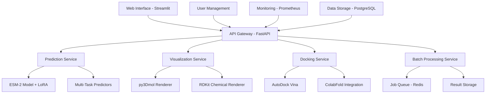

# Design Document: Protein-Drug Discovery LLM Platform

## Overview

The Protein-Drug Discovery LLM Platform is an end-to-end AI-powered system that combines state-of-the-art protein language models with interactive visualization and molecular docking capabilities. The platform leverages ESM-2 (650M parameters) as the base model with LoRA fine-tuning for parameter-efficient training, achieving sub-120ms inference times while maintaining >90% ROC-AUC accuracy.

The system democratizes drug discovery research by providing computational biologists and pharmaceutical researchers with powerful prediction capabilities, intuitive 3D visualization tools, and seamless integration with existing bioinformatics workflows.

## Architecture

### High-Level System Architecture



### Core Components

#### 1. AI/ML Stack
- **Base Model**: ESM-2 (650M parameters) for protein language modeling
- **Fine-tuning**: LoRA (Low-Rank Adaptation) using PEFT library
- **Framework**: PyTorch 2.7+ with Transformers library
- **Multi-Task Head**: Custom prediction layers for binding affinity, toxicity, solubility, ADMET

#### 2. API Layer
- **Web Framework**: FastAPI for high-performance REST API with async support
- **Server**: Uvicorn ASGI server for concurrent request handling
- **Authentication**: OAuth2/JWT integration with role-based access control
- **Rate Limiting**: Redis-based rate limiting for API protection

#### 3. User Interface
- **Web Application**: Streamlit for interactive research interface
- **3D Visualization**: py3Dmol and stmol for protein/drug structure rendering
- **2D Chemical Rendering**: RDKit for molecular structure display
- **Collaborative Tools**: Real-time sharing and annotation capabilities

#### 4. Computational Biology Integration
- **Structure Prediction**: ColabFold for protein folding analysis
- **Molecular Docking**: AutoDock Vina for binding pose prediction
- **Sequence Processing**: BioPython for FASTA and protein sequence handling

## Components and Interfaces

### Prediction Service Interface

```python
class PredictionService:
    def predict_binding(self, protein_sequence: str, drug_smiles: str) -> BindingPrediction:
        """
        Predicts protein-drug binding probability and confidence
        
        Args:
            protein_sequence: Amino acid sequence in FASTA format
            drug_smiles: Drug molecule in SMILES notation
            
        Returns:
            BindingPrediction with probability, confidence, and metrics
        """
        pass
    
    def predict_multi_task(self, protein_sequence: str, drug_smiles: str) -> MultiTaskPrediction:
        """Predicts binding affinity, toxicity, solubility, and ADMET properties"""
        pass
    
    def batch_predict(self, protein_sequences: List[str], drug_smiles_list: List[str]) -> List[BindingPrediction]:
        """Processes batch predictions with queue management"""
        pass
```

### Visualization Service Interface

```python
class VisualizationService:
    def render_protein_3d(self, protein_structure: str, binding_sites: List[int]) -> str:
        """
        Renders 3D protein structure with highlighted binding sites
        
        Args:
            protein_structure: PDB structure data
            binding_sites: List of residue indices for binding sites
            
        Returns:
            HTML/JavaScript for 3D visualization
        """
        pass
    
    def render_drug_2d(self, smiles: str) -> str:
        """Renders 2D chemical structure from SMILES"""
        pass
    
    def overlay_docking_poses(self, protein_structure: str, docking_poses: List[DockingPose]) -> str:
        """Overlays docking poses on protein structure"""
        pass
```

### Docking Service Interface

```python
class DockingService:
    def dock_compound(self, protein_pdb: str, drug_smiles: str) -> DockingResult:
        """
        Performs molecular docking using AutoDock Vina
        
        Args:
            protein_pdb: Protein structure in PDB format
            drug_smiles: Drug molecule in SMILES notation
            
        Returns:
            DockingResult with poses, binding energy, and RMSD
        """
        pass
    
    def validate_prediction(self, ai_prediction: BindingPrediction, docking_result: DockingResult) -> ValidationResult:
        """Correlates AI predictions with docking calculations"""
        pass
```

## Data Models

### Binding Prediction

```python
@dataclass
class BindingPrediction:
    protein_id: str
    drug_id: str
    binding_probability: float
    confidence_score: float
    binding_sites: List[int]
    inference_time: float
    model_version: str
```

### Multi-Task Prediction

```python
@dataclass
class MultiTaskPrediction:
    binding_prediction: BindingPrediction
    toxicity_score: float
    solubility_score: float
    admet_properties: Dict[str, float]
    overall_ranking: float
```

### Docking Result

```python
@dataclass
class DockingResult:
    poses: List[DockingPose]
    best_binding_energy: float
    rmsd_values: List[float]
    docking_time: float
    success: bool
```

### Batch Job

```python
@dataclass
class BatchJob:
    job_id: str
    user_id: str
    protein_sequences: List[str]
    drug_smiles: List[str]
    status: JobStatus
    progress: float
    results: List[BindingPrediction]
    created_at: datetime
    completed_at: Optional[datetime]
```

## Error Handling

### Model Inference Errors
- **Memory Overflow**: Automatic batch size reduction and gradient checkpointing
- **Model Loading Failures**: Fallback to cached model weights with error reporting
- **Timeout Handling**: 30-second timeout for predictions with graceful degradation

### Visualization Errors
- **3D Rendering Failures**: Automatic fallback to 2D visualization with user notification
- **Structure Format Issues**: Validation and conversion between PDB/FASTA formats
- **Browser Compatibility**: Progressive enhancement for different browser capabilities

### Docking Integration Errors
- **AutoDock Vina Failures**: Error diagnostics with alternative binding site suggestions
- **Structure Preparation Issues**: Automatic protein preparation with validation steps
- **Resource Limitations**: Queue management for computationally intensive docking jobs

## Testing Strategy

### Unit Testing
- **Model Inference**: Test prediction accuracy against known protein-drug pairs
- **Visualization Components**: Validate 3D rendering and 2D chemical structure display
- **Docking Integration**: Test AutoDock Vina integration with sample protein-drug pairs
- **API Endpoints**: Comprehensive testing of all REST API endpoints

### Integration Testing
- **End-to-End Workflows**: Complete prediction pipeline from input to visualization
- **Batch Processing**: Large-scale batch job processing with queue management
- **Multi-Task Predictions**: Correlation between different prediction types
- **Collaborative Features**: Team workspace functionality and data sharing

### Performance Testing
- **Inference Speed**: Validate sub-120ms response times across different model sizes
- **Throughput Testing**: 1000+ predictions per hour per GPU under load
- **Memory Usage**: Ensure <16GB VRAM usage during inference
- **Scalability**: Auto-scaling behavior under varying load conditions

### Scientific Validation
- **Benchmark Datasets**: Validation against BindingDB, ChEMBL, and PDB datasets
- **Cross-Validation**: K-fold validation on protein-drug interaction datasets
- **Comparative Analysis**: Performance comparison with existing drug discovery tools
- **Expert Review**: Validation by computational biology domain experts

## Implementation Details

### Model Training Pipeline

1. **Data Preparation**
   - Download and preprocess UniProt/UniRef protein sequences
   - Extract protein-drug interactions from ChEMBL and BindingDB
   - Standardize SMILES notation and protein sequence formats
   - Create train/validation/test splits (80/10/10)

2. **LoRA Fine-Tuning**
   - Initialize ESM-2 base model with frozen weights
   - Add LoRA adapters to attention and feed-forward layers
   - Implement multi-task learning heads for different prediction types
   - Use gradient checkpointing for memory efficiency

3. **Training Optimization**
   - Mixed precision training with automatic loss scaling
   - Learning rate scheduling with warmup and decay
   - Early stopping based on validation performance
   - Model checkpointing every epoch with best model selection

### Real-Time Inference Pipeline

1. **Input Processing**
   - Validate and tokenize protein sequences and SMILES strings
   - Apply sequence length limits and padding for batch processing
   - Cache frequently used protein embeddings for faster inference

2. **Model Inference**
   - Load LoRA-adapted ESM-2 model with optimized weights
   - Apply attention masking for variable-length sequences
   - Generate predictions with uncertainty quantification

3. **Post-Processing**
   - Apply calibration for confidence score accuracy
   - Format results for API response and visualization
   - Log prediction metrics for monitoring and analysis

### Deployment Architecture

- **Container Orchestration**: Docker containers with Kubernetes for auto-scaling
- **Load Balancing**: NGINX reverse proxy with health checks
- **Caching Layer**: Redis for model weights, embeddings, and API responses
- **Database**: PostgreSQL for user data, job history, and results storage
- **Monitoring**: Prometheus metrics with Grafana dashboards
- **Security**: HTTPS encryption, input validation, and rate limiting

### Performance Optimization

- **Model Optimization**: ONNX conversion for faster inference
- **Batch Processing**: Dynamic batching for improved GPU utilization
- **Caching Strategy**: Multi-level caching for embeddings and predictions
- **Resource Management**: GPU memory pooling and automatic cleanup